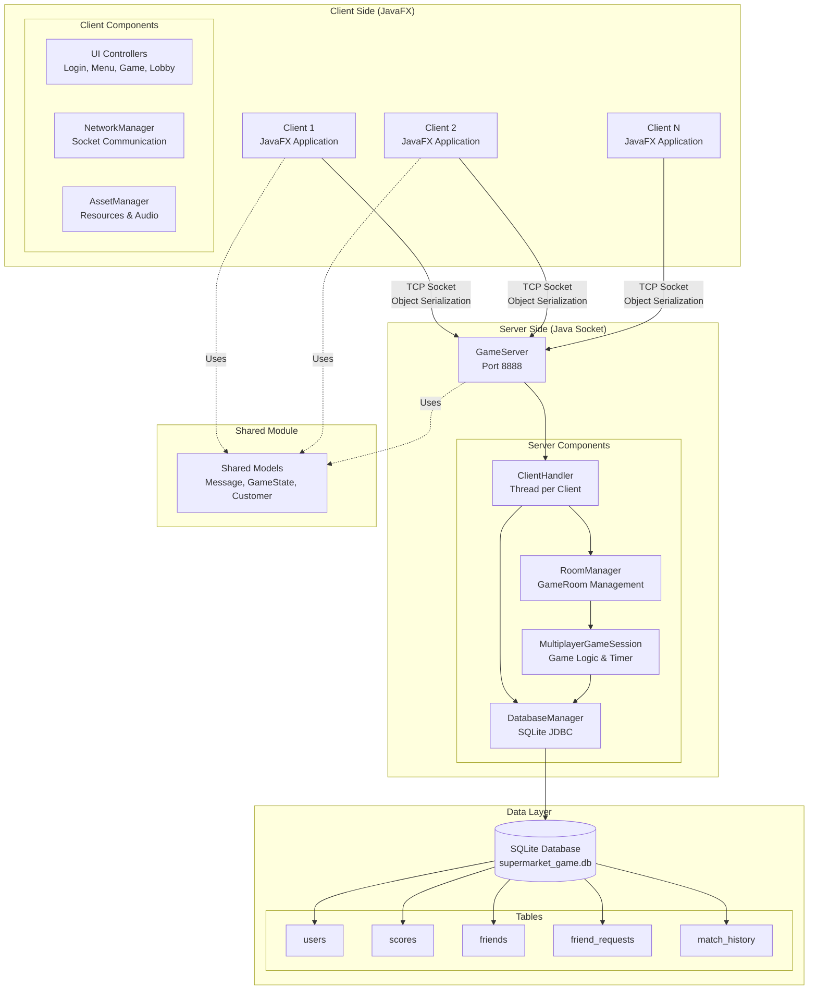
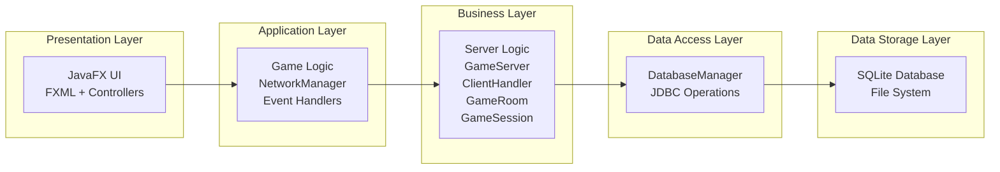
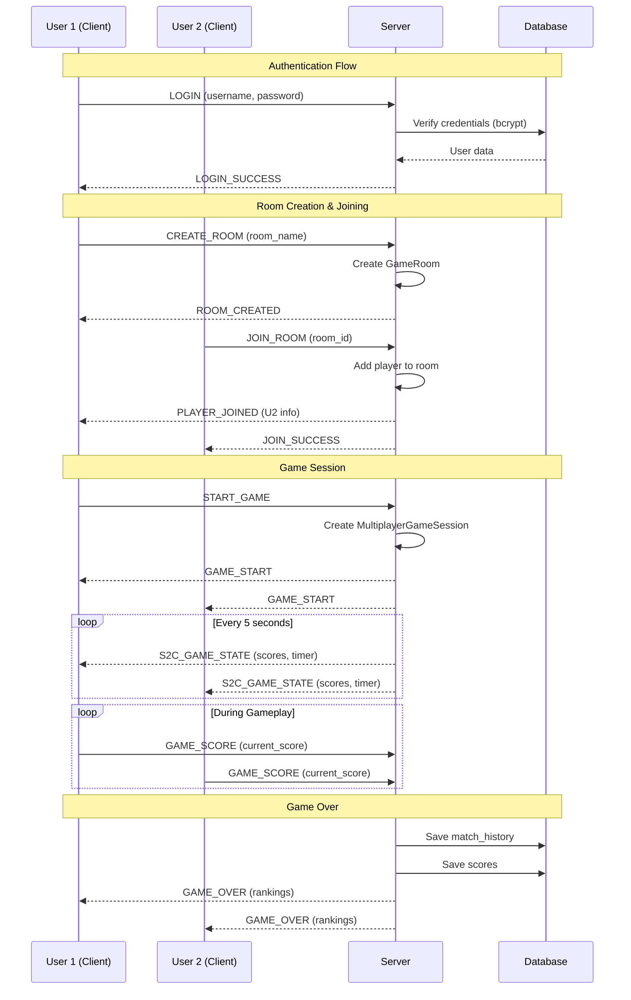
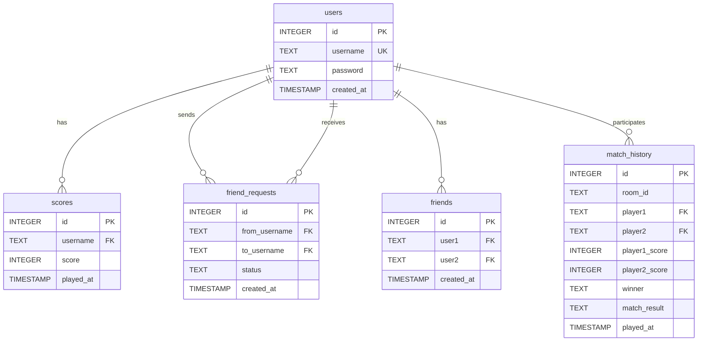
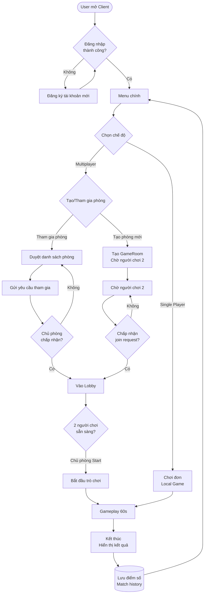
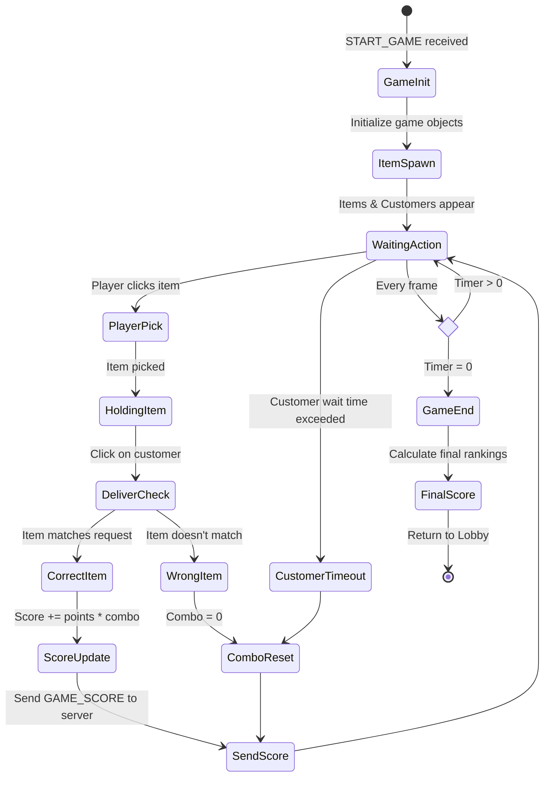
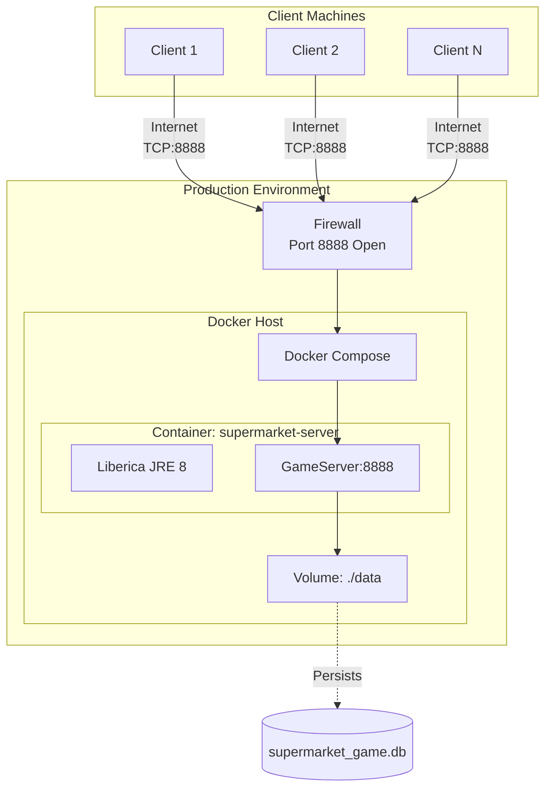
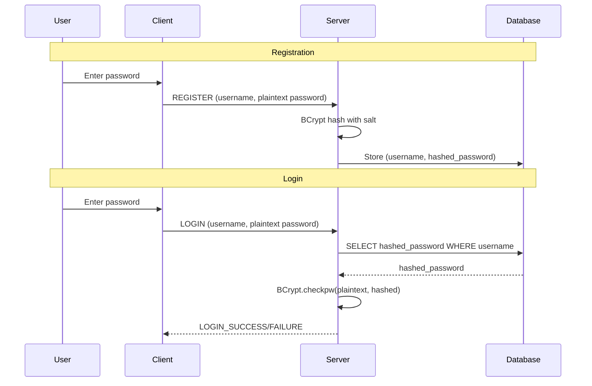
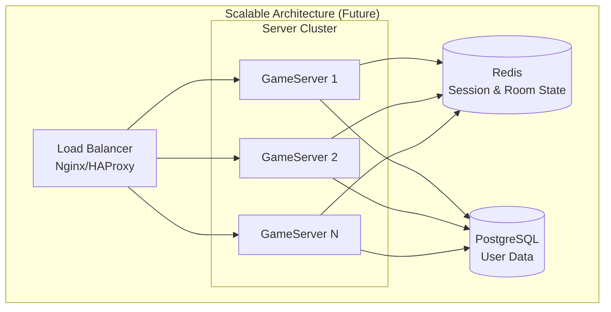

# Kiến Trúc Ứng Dụng Supermarket Game

## 1. TỔNG QUAN KIẾN TRÚC

Supermarket Game là một ứng dụng game multiplayer được xây dựng theo mô hình **Client-Server 3-tier architecture** sử dụng Java.

### 1.1. Sơ Đồ Kiến Trúc Tổng Quan



### 1.2. Kiến Trúc Chi Tiết theo Lớp



## 2. LUỒNG GIAO TIẾP CLIENT-SERVER

### 2.1. Sơ Đồ Giao Thức Truyền Thông



### 2.2. Các Loại Message

**Client → Server (C2S):**
- `LOGIN`, `REGISTER`: Authentication
- `CREATE_ROOM`, `JOIN_ROOM`, `LEAVE_ROOM`: Room management
- `START_GAME`: Start multiplayer session
- `GAME_SCORE`: Update player score
- `SEND_FRIEND_REQUEST`, `ACCEPT_FRIEND_REQUEST`: Friend system
- `INVITE_TO_ROOM`: Room invitation

**Server → Client (S2C):**
- `LOGIN_SUCCESS`, `REGISTER_SUCCESS`: Authentication response
- `ROOM_CREATED`, `JOIN_SUCCESS`, `PLAYER_JOINED`: Room updates
- `GAME_START`: Game session initiated
- `S2C_GAME_STATE`: Real-time game state sync
- `S2C_GAME_OVER`: Game results
- `FRIEND_REQUEST_RECEIVED`, `FRIEND_STATUS_UPDATE`: Friend updates

## 3. CẤU TRÚC CƠ SỞ DỮ LIỆU

### 3.1. Sơ Đồ ERD (Entity Relationship Diagram)



### 3.2. Chi Tiết Bảng Dữ Liệu

| Bảng | Mục đích | Indexes |
|------|----------|---------|
| `users` | Lưu thông tin tài khoản người dùng | username (UNIQUE) |
| `scores` | Lưu điểm số của người chơi | idx_scores_username, idx_scores_high |
| `friends` | Quan hệ bạn bè | idx_friends_user1, idx_friends_user2 |
| `friend_requests` | Lời mời kết bạn | UNIQUE(from_username, to_username) |
| `match_history` | Lịch sử trận đấu | idx_match_player1, idx_match_player2 |

## 4. STACK CÔNG NGHỆ

### 4.1. Backend (Server)
- **Ngôn ngữ:** Java 8 (JDK 1.8)
- **Network:** Java Socket Programming (ServerSocket)
- **Database:** SQLite 3.36.0.3 (JDBC)
- **Security:** jBcrypt 0.4 (password hashing)
- **Concurrency:** ScheduledExecutorService, ConcurrentHashMap
- **Serialization:** Java Object Serialization

### 4.2. Frontend (Client)
- **UI Framework:** JavaFX
- **Graphics:** JavaFX Scene Graph
- **Audio:** JavaFX Media
- **Pattern:** MVC (Model-View-Controller)
- **Build:** NetBeans/Ant

### 4.3. Deployment
- **Container:** Docker
- **JDK:** Liberica JDK 8 Full (Alpine)
- **Orchestration:** Docker Compose
- **Database Storage:** Docker Volume

## 5. LUỒNG HOẠT ĐỘNG CỦA GAME

### 5.1. Luồng Đăng Nhập và Tạo Phòng



### 5.2. Luồng Gameplay Chi Tiết



## 6. CÀI ĐẶT VÀ TRIỂN KHAI ỨNG DỤNG

### 6.1. Yêu Cầu Hệ Thống

#### Server
- **OS:** Linux/Windows/macOS
- **Java:** JDK 8 hoặc cao hơn
- **RAM:** Tối thiểu 512MB
- **Port:** 8888 (có thể cấu hình)
- **Database:** SQLite (tự động tạo)

#### Client
- **OS:** Linux/Windows/macOS
- **Java:** JDK 8 with JavaFX
- **RAM:** Tối thiểu 256MB
- **Network:** Kết nối Internet đến server

### 6.2. Cài Đặt và Chạy Server

#### Phương Pháp 1: Sử dụng Docker (Khuyên dùng)

```bash
# 1. Clone repository
git clone <repository-url>
cd supermarket_game

# 2. Build và chạy server với Docker Compose
docker-compose up -d

# 3. Kiểm tra logs
docker-compose logs -f supermarket-server

# 4. Kiểm tra trạng thái
docker ps
nc -zv localhost 8888

# 5. Dừng server
docker-compose down
```

**File cấu hình:** `docker-compose.yml`
```yaml
version: '3.8'
services:
  supermarket-server:
    build: .
    ports:
      - "8888:8888"
    volumes:
      - ./data:/app/data
    environment:
      - JAVA_OPTS=-Xms256m -Xmx512m
    restart: unless-stopped
    healthcheck:
      test: ["CMD", "nc", "-z", "localhost", "8888"]
      interval: 30s
      timeout: 10s
      retries: 3
```

#### Phương Pháp 2: Chạy Trực Tiếp với Java

```bash
# 1. Compile Server
cd SupermarketServer
javac -cp ".:lib/*" -d build src/**/*.java ../Shared/**/*.java

# 2. Chạy Server
cd build
java -cp ".:../lib/*" server.GameServer

# Server sẽ lắng nghe trên port 8888
```

### 6.3. Cài Đặt và Chạy Client

```bash
# 1. Compile Client
cd Client
javac -cp ".:lib/*" -d build src/**/*.java ../Shared/**/*.java

# 2. Cấu hình server address
# Chỉnh sửa config.properties
echo "server.host=localhost" > config.properties
echo "server.port=8888" >> config.properties

# 3. Chạy Client
cd build
java -cp ".:../lib/*" client.Main

# Hoặc sử dụng NetBeans IDE để build và run
```

### 6.4. Cấu Trúc Thư Mục Sau Khi Build

```
supermarket_game/
├── SupermarketServer/
│   ├── build/              # Compiled server classes
│   ├── lib/                # Dependencies (sqlite-jdbc, jbcrypt)
│   └── src/                # Server source code
├── Client/
│   ├── build/              # Compiled client classes
│   ├── lib/                # Dependencies
│   ├── src/                # Client source code
│   └── resources/          # Assets (images, sounds, FXML)
├── Shared/
│   └── src/                # Shared models
├── data/
│   └── supermarket_game.db # SQLite database
└── docker-compose.yml
```

### 6.5. Cấu Hình Server

**File:** `SupermarketServer/config.properties`
```properties
server.port=8888
database.path=data/supermarket_game.db
game.duration=60
max.players.per.room=2
cleanup.interval=60
```

**File:** `Client/config.properties`
```properties
server.host=localhost
server.port=8888
audio.enabled=true
music.volume=0.5
sfx.volume=0.7
```

### 6.6. Triển Khai Production

#### Bước 1: Chuẩn Bị Server

```bash
# 1. Cài đặt Docker và Docker Compose
sudo apt-get update
sudo apt-get install docker.io docker-compose

# 2. Clone code
git clone <repository-url>
cd supermarket_game

# 3. Cấu hình firewall
sudo ufw allow 8888/tcp
```

#### Bước 2: Build và Deploy

```bash
# 1. Build Docker image
docker-compose build

# 2. Chạy server trong background
docker-compose up -d

# 3. Kiểm tra logs
docker-compose logs -f

# 4. Setup auto-restart
docker update --restart=always <container-id>
```

#### Bước 3: Database Backup

```bash
# Backup database
docker-compose exec supermarket-server sqlite3 /app/data/supermarket_game.db ".backup '/app/data/backup.db'"

# Hoặc copy file trực tiếp
cp data/supermarket_game.db data/backup_$(date +%Y%m%d_%H%M%S).db
```

#### Bước 4: Monitoring

```bash
# Xem resource usage
docker stats supermarket-server

# Xem logs real-time
docker-compose logs -f --tail=100

# Health check
curl -v telnet://localhost:8888
```

### 6.7. Deployment Diagram



### 6.8. Troubleshooting

#### Vấn đề: Server không khởi động được

```bash
# Kiểm tra port đã được sử dụng chưa
netstat -tulpn | grep 8888
lsof -i :8888

# Kill process đang dùng port
kill -9 <PID>
```

#### Vấn đề: Client không kết nối được Server

```bash
# Kiểm tra firewall
sudo ufw status
sudo ufw allow 8888

# Test kết nối
telnet <server-ip> 8888
nc -zv <server-ip> 8888

# Kiểm tra config.properties
cat Client/config.properties
```

#### Vấn đề: Database lỗi

```bash
# Kiểm tra database integrity
sqlite3 data/supermarket_game.db "PRAGMA integrity_check;"

# Reset database (cảnh báo: mất dữ liệu)
rm data/supermarket_game.db
# Server sẽ tự tạo database mới khi khởi động
```

## 7. KIẾN TRÚC BẢO MẬT

### 7.1. Bảo Mật Mật Khẩu



### 7.2. Các Biện Pháp Bảo Mật

| Lớp | Biện pháp | Mô tả |
|-----|-----------|-------|
| **Authentication** | BCrypt hashing | Mật khẩu được hash với salt trước khi lưu |
| **Database** | PreparedStatement | Ngăn chặn SQL Injection |
| **Network** | Object Serialization | Kiểm tra type safety |
| **Session** | Server-side validation | Mọi action đều được validate trên server |
| **Authorization** | Room ownership | Chỉ host mới có quyền start game, kick player |

## 8. PERFORMANCE & SCALABILITY

### 8.1. Hiện Tại

- **Mô hình:** Thread-per-connection
- **Giới hạn:** ~1000 concurrent connections
- **Database:** Single SQLite file
- **Memory:** ~512MB per server instance

### 8.2. Khuyến Nghị Mở Rộng



**Cải tiến đề xuất:**
1. Thay SQLite bằng PostgreSQL/MySQL cho multi-instance
2. Sử dụng Redis cho session management và room state
3. Implement WebSocket thay vì raw Socket
4. Load balancer cho horizontal scaling
5. Microservices cho authentication, game logic, matchmaking

## 9. KẾT LUẬN

Supermarket Game được xây dựng với kiến trúc **Client-Server** rõ ràng, phân tách trách nhiệm tốt giữa các layer. Ứng dụng sử dụng công nghệ Java truyền thống nhưng được containerized bằng Docker để dễ dàng triển khai.

### Điểm Mạnh
- ✅ Kiến trúc rõ ràng, dễ bảo trì
- ✅ Sử dụng Docker cho deployment
- ✅ Bảo mật mật khẩu với BCrypt
- ✅ Real-time multiplayer synchronization
- ✅ Hệ thống bạn bè và match history đầy đủ

### Cơ Hội Cải Thiện
- 🔄 Migrate sang WebSocket cho real-time tốt hơn
- 🔄 Sử dụng database server thay vì SQLite
- 🔄 Implement horizontal scaling
- 🔄 Thêm monitoring và logging tập trung
- 🔄 API documentation (OpenAPI/Swagger)

---

**Tài liệu này được tạo tự động dựa trên phân tích codebase Supermarket Game.**
